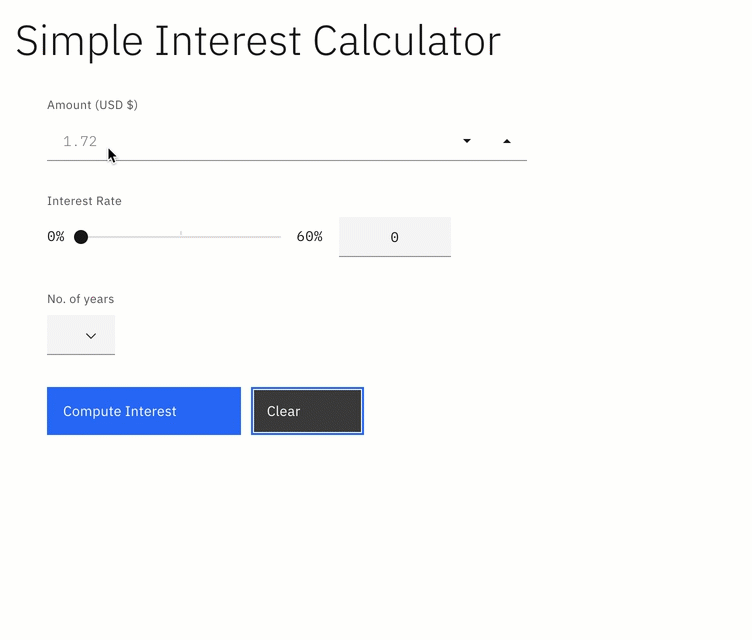

# Simple Interest Calculator

## Description

This final project for the [IBM CAD101EN badge](https://learning.edx.org/course/course-v1:IBM+CAD101EN+2T2020/home) (_via [edx.org](https://www.edx.org/)_) serves as a comprehensive demonstration of introductory cloud development skills HTML, CSS and JavaScript.  Students are asked to take code for an interest rate calculator web app provided by the instructors and to correct it's existing faults and enhance it's improvement and functionality based on a given client requirement list

## Requirements

* User is able to input a numeric value for Principal (_USD $_)
    - Principal values entered as 0 or less than 0 should result in an error message
* User selects an interest rate using a [range](https://developer.mozilla.org/en-US/docs/Web/HTML/Element/input/range) or "slider" element 
    - The value selected by the user is displayed next to range/slider element
* User selects the number of years from a selector or "dropdown" element
* Upon clicking a button:
    - The interest rate is calculated correctly
    - A summation of the data entry and the results of the calculation is displayed on the page
* Student must use GitHub for code change control
* Student will publish web app via GitHub Pages

## How to use

1. Access the app hosted on [GitPages](https://monstertruckdog.github.io/vftvk-Simple-Interest-Calculator/)
2. Type a positive, numeric value in the field labeled "Amount"
3. Use the slider to select an "Interest Rate"
4. Click the dropdown menu labeled "No. of years" and select the desired number of years
5. Click the blue button labeled "Compute Interest"

## Usage

## Highlights and Features

* Implemented IBM's open source design elements [Carbon](https://www.carbondesignsystem.com/) ("vanilla" instance) including the following:
    - Slider element
        - The functionality to display the numeric value associated with the selction is a built in feature
    - Numeric element
        - Includes functionality to increase or decrease the user entered input value by a defined step value
    - Dropdown element
    - Fonts
    - Overall body styling
* Lightweight:  no Javascript packages are required for deployment
    - Only CDN's used are:
        - CSS for Carbon's styling
        - JavaScript for Carbon's elements
* Though it wasn't required, a reset button is available for clearing user entered input values

## Future Enhancements

* Add more input validation
* Implement the Carbon "alert" icons to display in the input controls when validation error has occurred
* Experiment more with styling and display of the outcome results

## Access

* **GitHub Repository**:  [monstertruckdog/vftvk-Simple-Interest-Calculator](https://github.com/monstertruckdog/vftvk-Simple-Interest-Calculator)
* **Deployed App (_GitHub Pages_)**:  [Simple Interest Calculator](https://monstertruckdog.github.io/vftvk-Simple-Interest-Calculator/)
